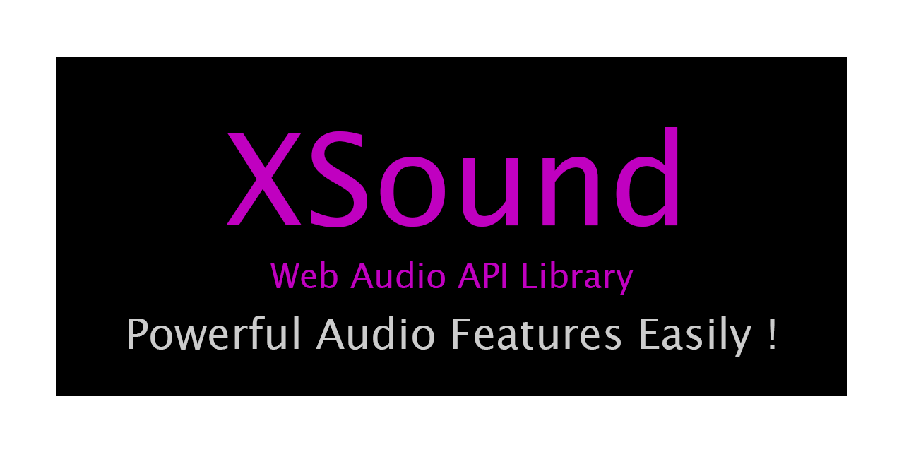

[](https://xsound.jp)

[](https://github.com/Korilakkuma/XSound/actions?query=workflow%3A%22Node.js+CI%22)

[](https://opensource.org/licenses/MIT)
[](https://www.npmjs.com/package/xsound)
[](https://www.jsdelivr.com/package/npm/xsound)
  
## Overview
  
XSound gives Web Developers Powerful Audio Features Easily !  
In concrete, XSound is useful to implement the following features.
  
- Create Sound
- Play the One-Shot Audio
- Play the Audio
- Play the Media
- Streaming (by WebRTC)
- MIDI (by Web MIDI API)
- MML (Music Macro Language)
- Effectors (Compressor / Wah / Equalizer / Tremolo / Phaser / Chorus / Delay / Reverb ... etc)
- Visualization (Overview in Time Domain / Time Domain / Spectrum)
- Multi-Track Recording (Create WAVE file)
- Session (by WebSocket)
- Audio Streaming
- Visual Audio Sprite
  
XSound don't depend on other libraries or frameworks (For example, jQuery, React).
  
## Supported Browsers
  

  
## Getting Started

In the case of using as **full stack** (For example, use oscillator) ...

```JavaScript
X('oscillator').setup([true, true, false, false]).ready().start([440, 880]);
```

or, in the case of using as **module base** (For example, use chorus effector) ...

```JavaScript
// The instance of `AudioContext`
const context = X.get();

// Create the instance of `Chorus` that is defined by XSound
const chorus = new X.Chorus(context);

const oscillator = context.createOscillator();

// The instance that is defined by XSound has connectors for input and output
oscillator.connect(chorus.INPUT);
chorus.OUTPUT.connect(context.destination);

// Set parameters for chorus
chorus.param({
  time : 0.025,
  depth: 0.5,
  rate : 2.5,
  mix  : 0.5
});

// Activate
chorus.activate();

oscillator.start(0);
```

XSound enable to using the following classes (Refer to [API Documentation](https://xsound.dev) for details).

```TypeScript
// These type aliases are defined by XSound
type BufferSize = 0 | 256 | 512 | 1024 | 2048 | 4096 | 8192 | 16384;
type Monoral    = 1;
type Stereo     = 2;
type RecordType = Monoral | Stereo;

X.Analyser(context: AudioContext);
X.Recorder(context: AudioContext, bufferSize: BufferSize, numberOfInputs: RecordType, numberOfOutputs: RecordType);
X.Session(context: AudioContext);

// Effectors
X.Autopanner(context: AudioContext);
X.Chorus(context: AudioContext);
X.Compressor(context: AudioContext);
X.Delay(context: AudioContext);
X.Distortion(context: AudioContext);
X.Equalizer(context: AudioContext);
X.Filter(context: AudioContext);
X.Flanger(context: AudioContext);
X.Listener(context: AudioContext);
X.Panner(context: AudioContext);
X.Phaser(context: AudioContext);
X.PitchShifter(context: AudioContext, size: BufferSize);
X.Reverb(context: AudioContext);
X.Ringmodulator(context: AudioContext);
X.Stereo(context: AudioContext, size, size: BufferSize);
X.Tremolo(context: AudioContext);
X.Wah(context: AudioContext);
```

## Demo
  
The application that uses XSound is in the following URLs.
  
- [XSound.app](https://xsound.app)
- [Music Tweet](https://github.com/Korilakkuma/Music-Tweet)
- [Chrome EQUALIZER](https://github.com/Korilakkuma/Chrome-EQUALIZER)
  
Now, I'm creating website for Web Audio API. Please refer to the following site for understanding API Documentation.
  
- [WEB SOUNDER](https://weblike-curtaincall.ssl-lolipop.jp/portfolio-web-sounder/)
  
## Playground

You can view overview on [YouTube](https://www.youtube.com/watch?v=zqdmoB8VICY).

[](https://xsound.jp/playground)

## Installation

```bash
$ npm install --save xsound
```

## Usage

In the case of using CDN,

```HTML
<script type="text/javascript" src="https://cdn.jsdelivr.net/npm/xsound@latest/build/xsound.min.js"></script>
```

In the case of using ES Modules for SSR ... etc,

```JavaScript
import { XSound, X } from 'xsound';
```

## Setup

### Use Webpack Dev Server

```bash
$ git clone git@github.com:Korilakkuma/XSound.git
$ cd XSound
$ npm install
$ npm run dev
$ open http://localhost:8080/playground/
```

### Use Docker

```bash
$ git clone git@github.com:Korilakkuma/XSound.git
$ cd XSound
$ npm install
$ npm run watch
$ docker-compose up -d --build
$ open http://localhost:8080/playground/
```

## API Documentation
  
- [XSound API Documentation](https://xsound.dev)
  
## Migration to v3

Please refer to [API Documentation](#api-documentation) for details.

### Case sensitive

```JavaScript
// Bad (v2 or earlier)
X('audio').module('panner').param({ coneinnerangle: 240 });

// Good (v3)
X('audio').module('panner').param({ coneInnerAngle: 240 });
```

### Use plain object if parameters setter

```JavaScript
// Bad (v2 or earlier)
X('oscillator').get(0).param('type', 'sawtooth');

// Good (v3)
X('oscillator').get(0).param({ type: 'sawtooth' });
```

### Validate parameters on the application side

```JavaScript
if ((type === 'sine') || (type === 'square') || (type === 'sawtooth') || (type === 'triangle')) {
  X('oscillator').get(0).param({ type });
}
```

## Pickups
  
- [9 libraries to kickstart your Web Audio stuff - DEV Community](https://dev.to/areknawo/9-libraries-to-kickstart-your-web-audio-stuff-460p)
  - <blockquote>XSound is a batteries-included library for everything audio. From basic management and loading through streaming, effects, ending with visualizations and recording, this libraries provides almost everything! It also has nice, semi-chainable API with solid documentation.</blockquote>
- [20 Useful Web Audio Javascript Libraries – Bashooka](https://bashooka.com/coding/web-audio-javascript-libraries/)
- [Extending X3D Realism with Audio Graphs, Acoustic  Properties and 3D Spatial Sound](https://dl.acm.org/doi/10.1145/3424616.3424709)
  
## License
  
Released under the [MIT](https://github.com/Korilakkuma/XSound/blob/main/LICENSE) license
  
