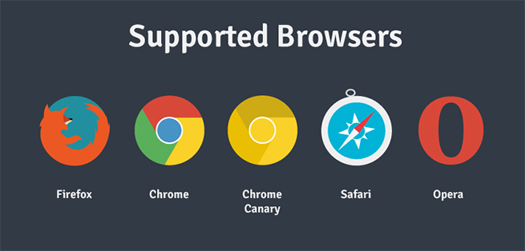

[](https://travis-ci.org/Korilakkuma/XSound)
[](https://opensource.org/licenses/MIT)
[](https://www.npmjs.com/package/xsound)


[](https://www.jsdelivr.com/package/npm/xsound)

  
## Overview
  
This is full stack library for Web Audio API.  
In concrete, this library may be useful to implement the following features.
  
- Create Sound
- Play the One-Shot Audio
- Play the Audio
- Play the Media
- Streaming (by WebRTC)
- MIDI (by Web MIDI API)
- MML (Music Macro Language)
- Effectors (Compressor / Wah / Equalizer / Tremolo / Phaser / Chorus / Delay / Reverb ...etc)
- Visualization (Overview in Time Domain / Time Domain / Spectrum)
- Recording (Create WAVE file)
- Session (by WebSocket)
  
This don't depend on other libraries or frameworks (like jQuery, React).
  

  
## Getting Started

```JavaScript
X('oscillator').setup(true).ready().start(440);
```

But, it is necessary to invoke `X.setup` method by user gestures in Chrome 66+.

```JavaScript
document.body.addEventListener('click', () => {
    X.setup();
}, false);
```
  
## Demo
  
The application that uses this library is in the following URL.  
  
- [X Sound](https://korilakkuma.github.io/X-Sound/)
- [Music V](https://weblike-curtaincall.ssl-lolipop.jp/portfolio-music-v/)
- [Music Tweet](https://github.com/Korilakkuma/Music-Tweet)
  
Now, I'm creating website for Web Audio API. Please refer to the following site for understanding API Document.
  
- [WEB SOUNDER](https://weblike-curtaincall.ssl-lolipop.jp/portfolio-web-sounder/)
  
## Installation

```bash
$ npm install --save xsound
```

## Usage

```HTML
<script type="text/javascript" src="xsound.js"></script>
```

In the case of using WebSocket,

```bash
$ node xsound-server-session-websocket.js
```

or,

```bash
$ node xsound-server-session-ws.js
```

Default port number is 8000.  
This port number can be changed by designating argument.  
For example,

```bash
$ node xsound-server-session-websocket.js 8080
```

In the case of recording log, the path of log file must be designated by the 2nd argument.

```bash
$ node xsound-server-session-websocket.js 8080 websocket.log
```

## API Document
  
- [XSound API Document](https://korilakkuma.github.io/XSound/)
  
## License
  
Copyright (c) 2011, 2012, 2013, 2014, 2015, 2016, 2017 Tomohiro IKEDA (Korilakkuma)  
Released under the MIT license
  
